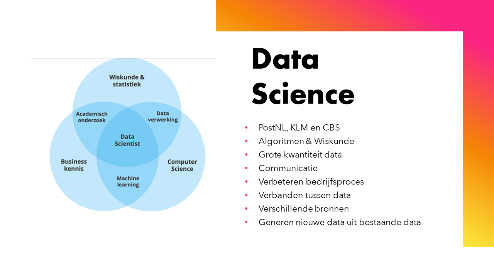

## Table of contents
* [What is Data science](#what-is)

#### What is
Data science is the analysis of important data using code.\
One of the most important and upcoming aspects of data science is Artifical Intelligence.\
Companies find it very important to be ahead by improving their business intelligence with big data.
