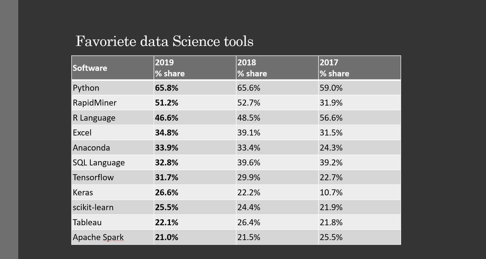

## Table of contents

* [About](#what-is-data-science)
* [tools](#what-data-science-tools-exist)

#### What is Data Science?

Data science is a method of transforming data into valuable business strategies. It is a tool for making sound decisions
to increase profits, improve the customer journey and spot opportunities.

Data science, or data science, is a methodology for extracting insights from (semi) structured data collected primarily
from databases and unstructured data. Unstructured data includes data collected from non-specified formats. This can be
anything like a video, images, social media or even emails and Word files. Organisations are using data science to
further analyse the status of business goals. This manifests itself in various forms to grow sales and reduce costs.

Think for example of product development, detecting bottlenecks in production and customer experience optimisation. Data
science is a good innovative way to make economic predictions. Data science is the generation of new data from existing
data. The outcome is therefore not a service but an information product. Data science makes the creation of new data
products possible.

The numerical analysis of business processes with the aim of improving these business processes: this is often called
analytics in the management sciences. Analytics, or business analytics, or sometimes a little bit more advanced
analytics: in essence, it all means the same thing. The improvement objective depends on the context. Think of
increasing efficiency, improving quality or reducing risks.

Of course, there are many ways to analyse this, but analytics is about quantitative, numerical analyses, often based on
statistics and algorithms. Data science is a field that focuses on gaining insights from data. Data scientists use
programming skills, statistical knowledge, and sector and organisational knowledge to make connections and distil
valuable insights.

#### What Data Science tools exist?

There are a lot of languages that can be used to create your software.\
Here are a few languages used for Big Data, along with the popularity.

